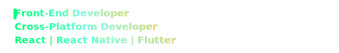

<h1 align="center"> Hey there! Welcome to my GitHub Profile ;) </h1>

  

  I'm <b>Khaled Mohamed Mahmoud</b> ✨ 
  A <b>Front-End Developer</b> and <b>Cross-Platform Developer</b> 💻 
  I build modern web and mobile apps using <b>React</b>, <b>React Native</b>, and <b>Flutter</b> ⚡

---

  

---

<h3 align="center">💻 Tools & Technologies</h3>

  

---

  

